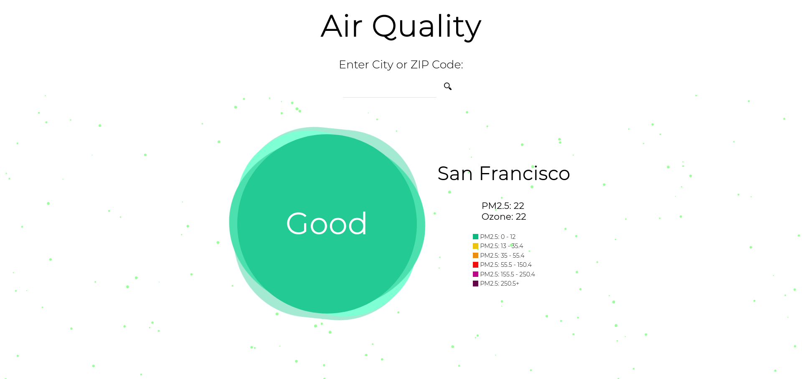

# Air Quality App (React part)
Backend part [here](https://github.com/LiaTsernant/air-quality)

Designed and implemented an app that allows users to see current air quality in San Francisco Area.

Integrated with AirNow API for displaying most recent data.

## Frontend Tech:
Currently in progress:
* React,
* HTML / CSS,
* [Lodash](https://lodash.com/),
* [Particles.js](https://vincentgarreau.com/particles.js/).

## Decicions made:
* Create server:
  * For being able to store my api key I decided to create a server that proxies the request to the original server. I also added a cron like task scheduler for grabbing the recent information and storing it to the database.

  * Use particles.js: I really liked this lightweight JavaScript library for creating particles. It is a very user friendly library that helps to achieve a great result.

  * Debounce search: insted of updating the state of the component on each character and re-rendering, I decided to use debounce function that was provided by Lodash. This function helps update state once when user stopped typing.

## Next plans:
  * Get rid of hardcoded data about city zip codes and use API (Open Steet Maps or Google Maps).